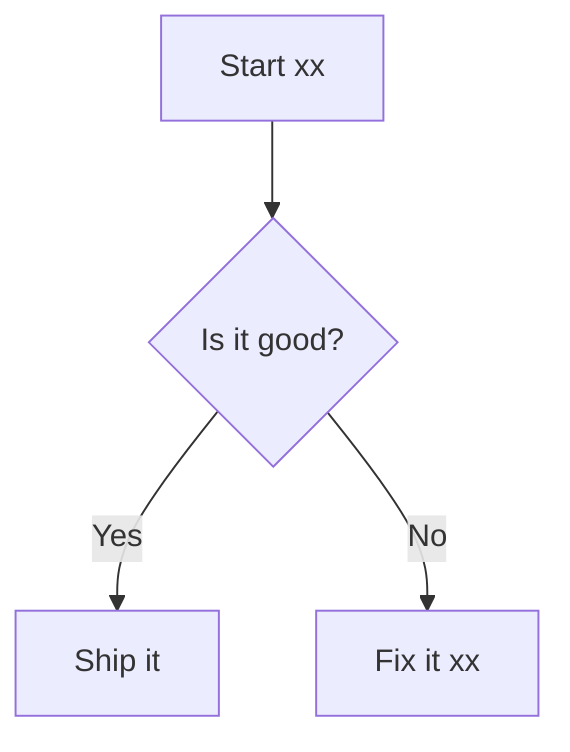
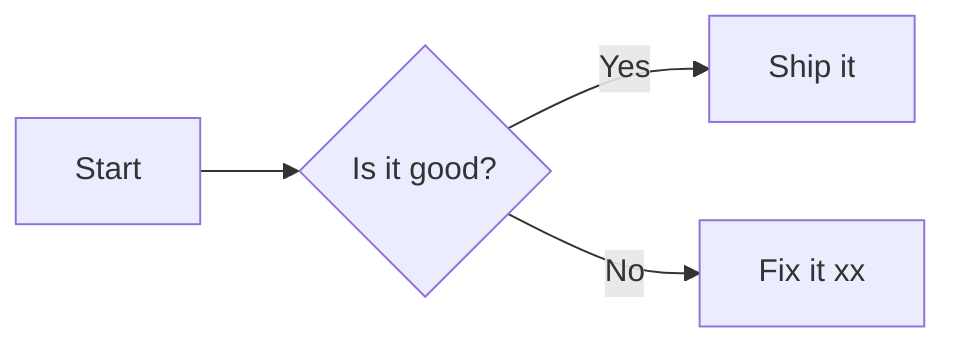

```mermaid
graph TD
  A[Start xx] --> B{Is it good?}
  B -->|Yes| C[Ship it]
  B -->|No| D[Fix it xx]
```

```mermaid
graph LR
  A[Start] --> B{Is it good?}
  B -->|Yes| C[Ship it]
  B -->|No| D[Fix it xx]

```
